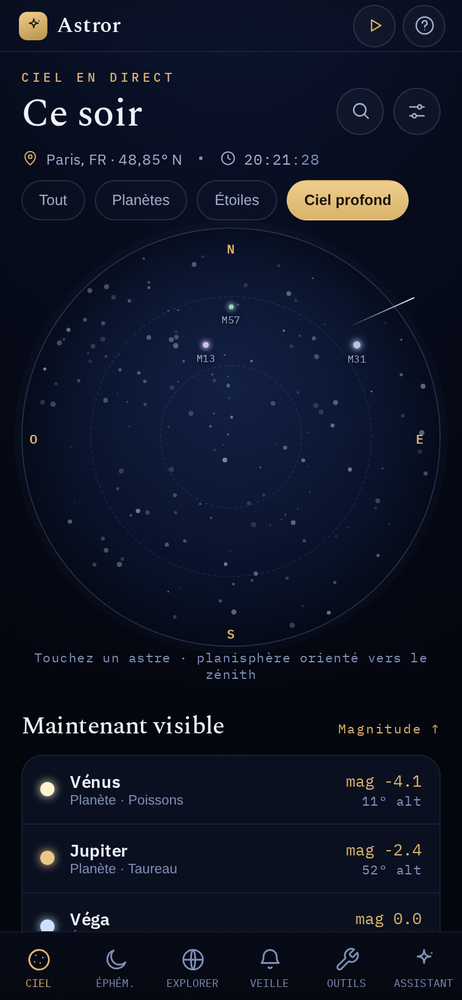
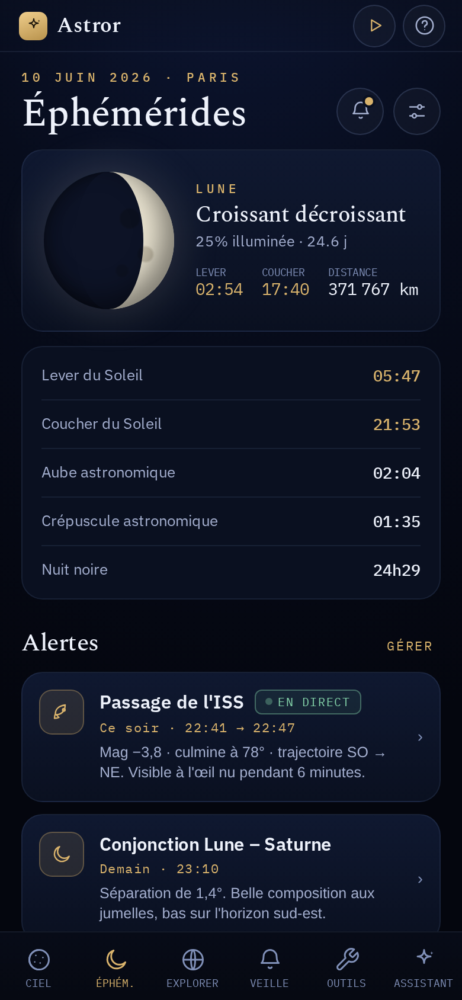
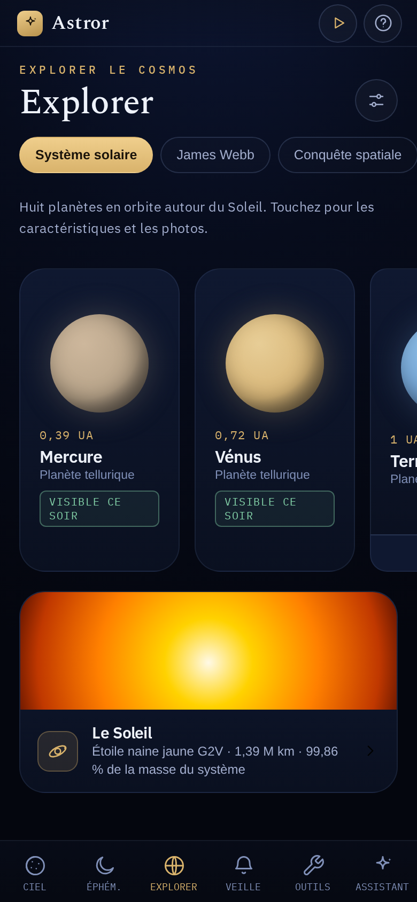
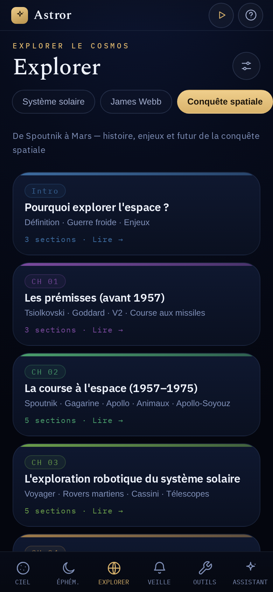
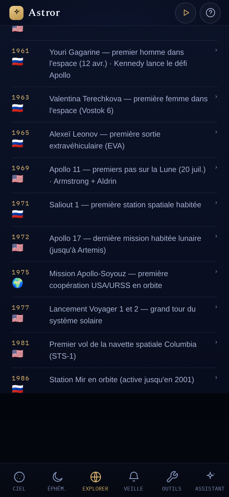
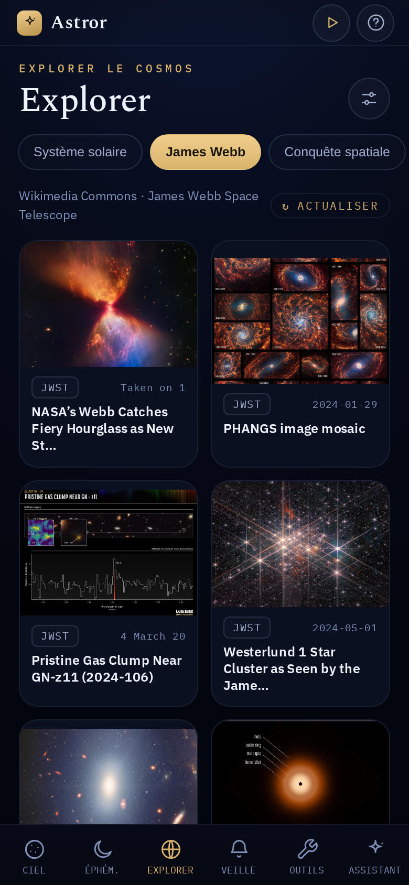
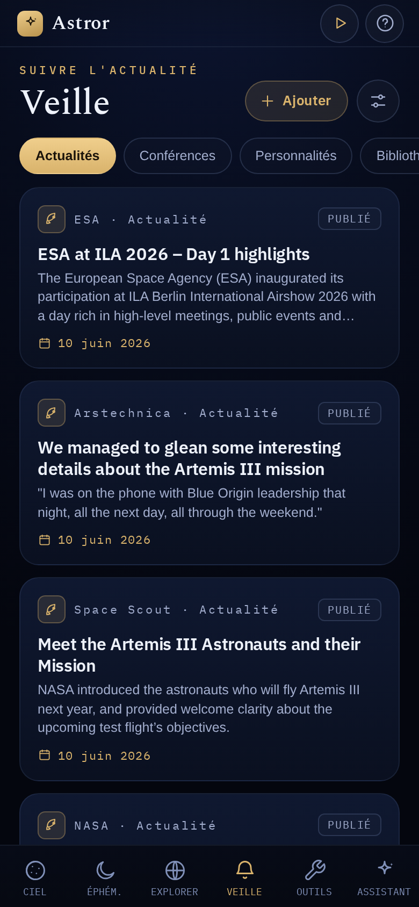
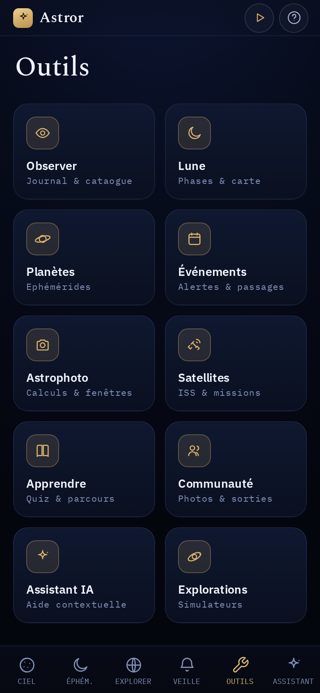
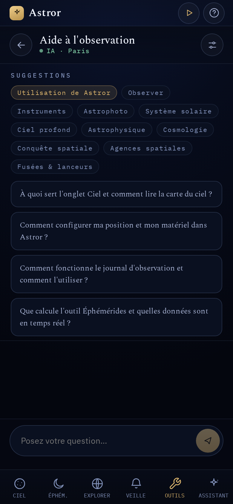
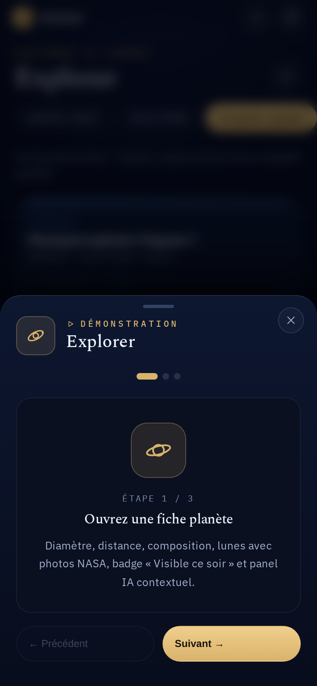

# Astror

[](LICENSE)


Compagnon d'observation astronomique — application mobile PWA pour astronomes amateurs, entièrement en français.

**[→ Utiliser Astror](https://astror.swinux.ch)** · **[Documentation](https://nouhailler.github.io/astror/)** · **[Changelog](CHANGELOG.md)**

## Captures d'écran

<table>
  <tr>
    <td align="center">
      <br/>
      <sub><b>Carte du Ciel</b><br/>Planisphère temps réel, boussole AR</sub>
    </td>
    <td align="center">
      <br/>
      <sub><b>Éphémérides</b><br/>Lune, Soleil, alertes, événements</sub>
    </td>
    <td align="center">
      <br/>
      <sub><b>Système solaire</b><br/>8 planètes avec visibilité live</sub>
    </td>
  </tr>
  <tr>
    <td align="center">
      <br/>
      <sub><b>Conquête spatiale</b><br/>Article complet en 10 chapitres</sub>
    </td>
    <td align="center">
      <br/>
      <sub><b>Annexes — Chronologie</b><br/>34 dates clés cliquables</sub>
    </td>
    <td align="center">
      <br/>
      <sub><b>Fiche Wikipédia</b><br/>Photo + résumé + panel IA</sub>
    </td>
  </tr>
  <tr>
    <td align="center">
      <br/>
      <sub><b>James Webb</b><br/>Dernières images Wikimedia</sub>
    </td>
    <td align="center">
      <br/>
      <sub><b>Veille spatiale</b><br/>Actualités, conférences, personnalités</sub>
    </td>
    <td align="center">
      <br/>
      <sub><b>Outils</b><br/>10 modules spécialisés</sub>
    </td>
  </tr>
  <tr>
    <td align="center">
      <br/>
      <sub><b>Assistant IA</b><br/>Chat contextuel</sub>
    </td>
    <td align="center">
      <br/>
      <sub><b>Conquête — chapitre</b><br/>Lecture immersive d'un chapitre</sub>
    </td>
    <td></td>
  </tr>
</table>

## Stack technique

| Élément | Valeur |
|---|---|
| Framework | React 18 + Vite 5 |
| PWA | vite-plugin-pwa (Workbox), mise à jour automatique en arrière-plan |
| Calculs astronomiques | astronomy-engine (local, sans API) |
| Prédictions satellites | satellite.js + TLE en direct |
| Tests | Vitest (39 tests) |
| Déploiement | Netlify ([astror.swinux.ch](https://astror.swinux.ch)) + GitHub Pages pour la documentation |
| Licence | [MIT](LICENSE) |

## Liens

| | |
|---|---|
| Démo en ligne | https://astror.swinux.ch |
| Documentation | https://nouhailler.github.io/astror/ |
| Dépôt GitHub | https://github.com/nouhailler/astror |
| Signaler un bug | https://github.com/nouhailler/astror/issues/new |
| Dev local | `npm run dev` → http://localhost:5173 |

## Lancer le projet

```bash
npm install
npm run dev       # Serveur de développement
npm run build     # Build de production → dist/
npm run test      # Tests Vitest
npm run preview   # Prévisualiser le build
```

## Navigation

En plus des 6 onglets ci-dessous, un **menu hamburger** (☰, en haut de chaque écran) liste l'intégralité
des fonctionnalités classées par catégorie, avec navigation directe. Il donne aussi accès à l'écran
**« À propos »** (version, build, développeur, support avec diagnostics pré-remplis, crédits open-source).

## Structure des onglets

| Onglet | Fichier | Description |
|---|---|---|
| Ciel | `sky.jsx` | Carte SVG du ciel, boussole AR, curseur temporel (+12 h), fiches constellations |
| Éphémérides | `ephemerides.jsx` | Lune, météo open-meteo, alertes ISS/conjonctions, événements astronomiques |
| Explorer | `explore.jsx` | Planètes live, 88 constellations, images JWST, conquête spatiale, anomalies, théories |
| Veille | `feed.jsx` | Actualités spatiales, conférences, livres, personnalités, photos du ciel |
| Outils | `tools.jsx` | 10 outils spécialisés (voir ci-dessous) |
| Assistant | `assistant.jsx` | Chat IA contextuel (OpenRouter → Anthropic → intégration hôte) |

## Onglet Explorer — sous-onglets

| Sous-onglet | Description |
|---|---|
| Système solaire | Fiche de chaque planète + badge visibilité live + lunes (photos NASA) + panel IA + section « Les 88 constellations » |
| James Webb | Dernières images Wikimedia avec description et lien NASA |
| Conquête spatiale | Article complet "De Spoutnik à Mars" : 10 chapitres + annexes interactives |
| Anomalies | Phénomènes inexpliqués avec panel IA et lien Wikipédia |
| Théories | Grandes théories (matière noire, trous noirs…) avec panel IA |

### Conquête spatiale — détail des annexes

Les annexes Chronologie/Glossaire/Missions sont interactives : chaque entrée est cliquable et ouvre une fiche Wikipédia (thumbnail + résumé + panel IA + lien article). Les Biographies restent statiques.

| Annexe | Contenu |
|---|---|
| Chronologie | 33 dates clés de 1903 à 2030s, chacune liée à un article Wikipédia |
| Glossaire | 16 termes spatiaux (Ligne de Kármán, Delta-v, EVA…) liés à Wikipédia |
| Missions | 15 missions emblématiques (Spoutnik 1 → Artemis I) liées à Wikipédia |
| Biographies | 8 pionniers (Tsiolkovski, Gagarine, Armstrong…) — non cliquables |

## Outils

| Outil | Fichier | Description |
|---|---|---|
| Observer | `tool-observe.jsx` | Journal d'observation + créneaux dynamiques |
| Lune | `tool-moon.jsx` | Phase, illumination, âge, distance et calendrier calculés en direct + carte lunaire |
| Planètes | `tool-planets.jsx` | Éphémérides calculées en direct + simulateur oculaire |
| Événements | `tool-events.jsx` | Calendrier céleste + notifications |
| Astrophoto | `tool-astrophoto.jsx` | Calculs exposition + simulateur cadrage |
| Satellites | `tool-satellites.jsx` | ISS live, passages prédits (satellite.js + TLE), Tiangong, Hubble |
| Apprendre | `tool-education.jsx` | Quiz 40 questions + catégories + chrono + joker, glossaire 47 termes, parcours |
| Communauté | `tool-community.jsx` | Fil (Mastodon), classement (Google Sheets), sorties (RSS) |
| Assistant IA | `tool-ai.jsx` | Chat contextuel avec profil utilisateur |
| Explorations | `tool-extras.jsx` | ScaleExplorer + ImpactSim + Top10 + Voyages |

## Mode démo

Un moteur DOM indépendant de React peut rejouer des parcours utilisateur en pilotant l'interface réelle
(curseur virtuel, surbrillance, narration). Activable depuis Paramètres ou via `?demo=<scénario>`.
Les données restent isolées : snapshot/restauration du `localStorage`, jamais d'écriture dans les données
réelles de l'utilisateur. Voir `src/demo/`.

## APIs utilisées

| Service | Usage | Clé requise |
|---|---|---|
| open-meteo.com | Météo locale | Non |
| wheretheiss.at / celestrak.org | Position et passages ISS/Tiangong | Non |
| lldev.thespacedevs.com | Prochains lancements | Non |
| spaceflightnewsapi.net | Actualités spatiales | Non |
| api.nasa.gov | APOD (DEMO_KEY suffisante) | Non |
| Wikimedia Commons | Images JWST, planètes, personnalités, conférences | Non |
| fr.wikipedia.org / en.wikipedia.org | Résumés + photos (fiches contextuelles) | Non |
| OpenLibrary | Recherche et couvertures de livres | Non |
| Google Books | Recherche de livres (prioritaire si clé fournie) | Optionnelle |
| Mastodon (mastodon.social) | Fil communautaire | Non |
| rss2json.com | Flux RSS (sorties club) | Non |
| Google Sheets (CSV) | Classement communautaire | Non (URL fournie par l'utilisateur) |
| Nominatim (OpenStreetMap) | Géocodage inverse (position → ville) | Non |
| Anthropic | Assistant IA | Oui — clé personnelle dans Paramètres |
| OpenRouter | Assistant IA (modèles gratuits, prioritaire) | Oui — clé personnelle dans Paramètres |

Détail complet, avec comportement de repli en cas d'échec : [référence des APIs](https://nouhailler.github.io/astror/reference/apis/).

## localStorage

| Clé | Contenu |
|---|---|
| `astror_profile_v1` | Profil : `{ city, lat, lng }`, niveau, intérêts, matériel, alertes |
| `astror_onboarded_v1` | Flag onboarding vu |
| `astror_journal_v1` | Sessions du journal d'observation |
| `astror_veille_v1` | Entrées Veille ajoutées par l'utilisateur |
| `astror_quiz_v1` | Stats quiz : streak, record, total joués |
| `astror_xp_v1` | XP total + date dernier défi complété |
| `astror_parcours_v2` | Progression par parcours pédagogique |
| `astror_notif_prefs_v1` | Préférences de notification par catégorie d'événement |
| `astror_tips_v1` | Bandeaux d'astuces déjà masqués |
| `astror_api_key_v1` | Clé API **Anthropic** |
| `astror_or_key_v1` / `astror_or_model_v1` | Clé + modèle **OpenRouter** (prioritaire sur Anthropic) |
| `astror_gbooks_key_v1` | Clé API Google Books (optionnelle) |
| `astror_community_sheet_v1` | URL de la feuille Google Sheets du classement communautaire |
| `astror_ai_cache_v1` | Cache des réponses IA (panels contextuels) |
| `astror_wiki_thumbs_v1` | Cache de vignettes Wikipédia des personnalités |
| `astror_book_covers_v1` | Cache des couvertures de livres |
| `astror_conf_imgs_v1` | Cache des images de conférences |
| `astror_site_photos_v1` | Cache de vignettes par site photo |
| `astror_pwa_last_check_v1` | Date/heure de la dernière vérification de mise à jour |
| `astror_pwa_last_update_v1` | Date/heure de la dernière mise à jour appliquée |

Détail complet (origine, transmission, finalité) : [données et confidentialité](https://nouhailler.github.io/astror/data/).

## Conventions

- Pas de circular imports : les tool pages importent depuis `./tool-ui`, jamais depuis `./tools`.
- `SettingsSheet` est un `export default` qui gère son propre `<Sheet>` en interne.
- `window.openAstrorSettings` / `window.openAstrorTool` / `window.openAstrorDemo` sont enregistrés dans `App.jsx` via `useEffect`.
- Les apostrophes françaises dans les strings JS doivent être échappées (`l\'espace`) ou en double quotes.
- `profile.location` est un objet `{ city, lat, lng }` (migration auto dans `onbLoad()`).
- Les Sheets imbriqués dans un composant avec animation CSS (`transform`) doivent utiliser `createPortal` vers `#root` pour éviter les problèmes de containing block.
- Numéro de version affiché dans l'app lu depuis `package.json` (`__APP_VERSION__`, injecté au build par `vite.config.js`) — ne jamais le coder en dur.

## Contribuer

Projet personnel, mais les retours et suggestions sont bienvenus via les [issues GitHub](https://github.com/nouhailler/astror/issues). Voir [CLAUDE.md](CLAUDE.md) pour les conventions de développement et [DOCUMENTATION_SPEC.md](DOCUMENTATION_SPEC.md) pour les conventions de documentation.

## Licence

[MIT](LICENSE) © 2026 [Patrick Nouhailler](https://swinux.ch)
